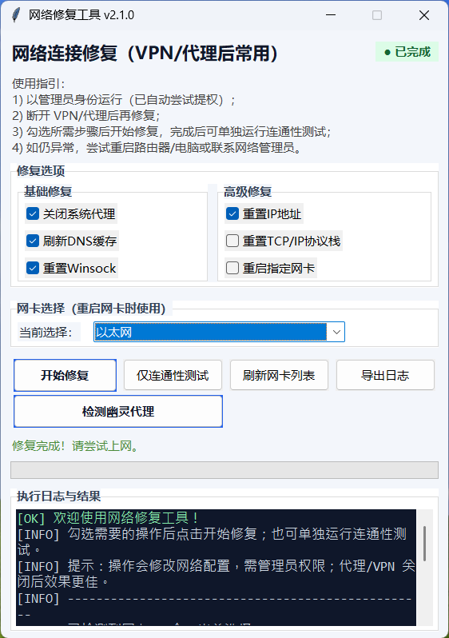

# 🌐 NetworkFixer (网络修复工具)

[](https://www.python.org/)
[](LICENSE)
[](https://www.microsoft.com/windows)

**NetworkFixer** 是一个轻量级的 Windows 网络修复工具，专为解决 VPN、代理软件关闭后无法上网的问题而设计。




## 🚀 主要功能

- **一键修复系统代理**：清除残留的系统代理配置（最常见的断网原因）。
- **网络环境重置**：支持刷新 DNS 缓存、重置 Winsock 目录、重置 IP 地址。
- **深度修复**：提供重置 TCP/IP 协议栈和重启指定网卡的高级选项。
- **可视化日志**：实时显示修复进度和操作结果。
- **连通性测试**：修复完成后自动 Ping 测试 (114/8.8.8.8) 及 HTTP 连通性检测。

## 📥 下载与使用

### 方式一：直接下载 (推荐普通用户)
前往 [Releases 页面](https://github.com/HYGUO1993/NetworkFixer/releases) 下载最新的 `.exe` 文件，右键以**管理员身份运行**即可。

### 方式二：通过源码运行 (开发者)
如果你安装了 Python 3.8+ 环境：

1. 克隆仓库：
   ```bash
   git clone https://github.com/HYGUO1993/NetworkFixer.git
   cd NetworkFixer
   ```

2. 运行程序：
   ```powershell
   # 运行脚本（脚本内会自动请求管理员权限）
   python fix_network.py
   ```

## 📦 打包为 EXE

如果你想自己编译生成 EXE 文件：

1. 安装 PyInstaller：
   ```bash
   pip install pyinstaller
   ```

2. 执行打包命令：
   ```bash
   pyinstaller --noconfirm --clean --windowed --name NetworkFixer fix_network.py
   ```
   打包完成后，EXE 文件位于 `dist/NetworkFixer/NetworkFixer.exe`。

## ❓ 常见问题 (Troubleshooting)

- **运行即退出/未见窗口**：请确认以管理员身份启动；若 UAC 被安全软件拦截，请在信任后重试。
- **无法导出日志**：确认目标目录写入权限，或导出到桌面再尝试。
- **重置 TCP/IP 后仍无网**：尝试重启电脑/路由器，或联系网络管理员。
- **Ping 不通但 HTTP 可用**：可能被 ICMP 屏蔽，重点关注 HTTP 结果。

## ⚠️ 免责声明

本工具仅执行常见网络修复命令（如 `netsh`, `ipconfig`），使用前请确保了解其效果。若为公司或受管设备，请遵循相关 IT 策略。
